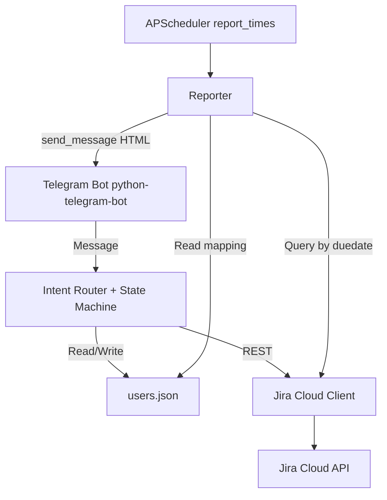

# Master Plan: Jira Task Bot (Telegram + Jira Cloud)

## 1. Mục tiêu
- Bot chạy trong nhóm Telegram chung của thành viên project.
- Hỗ trợ 2 use case tương tác (không dùng LLM):
  - `giao việc`: Admin có thể giao cho người khác; Member chỉ được tự giao cho mình.
  - `việc của tôi`: người dùng tự tạo task cho chính mình.
- Tạo issue trong Jira Cloud:
  - Due date dùng field chuẩn `duedate`.
  - Checklist tạo thành Sub-tasks (mỗi item 1 sub-task con).
  - File upload từ Telegram (nếu có) sẽ được gắn vào Jira issue dưới dạng attachment.
- Định kỳ (theo `due.notification.report_times`, timezone `report_timezone`, mặc định 2 lần/ngày `Asia/Ho_Chi_Minh`) bot gửi báo cáo:
  - Tổng số task sắp đến hạn, tổng số task đã quá hạn.
  - Chi tiết từng assignee (assignee là các thành viên có mapping trong Telegram group).

## 2. Nguồn dữ liệu người dùng
- Mapping `telegram_account_id` <-> `jira_account_id` được lưu trong `users.json`.
- Quy tắc:
  - Nếu user/jira account chưa có trong `users.json`, bot yêu cầu người dùng gửi `jira_account_id` để bổ sung mapping.
  - Không tự động “đổi” `jira_account_id` đã tồn tại (trừ khi bạn muốn mở rộng rule; hiện tại giữ mặc định là không overwrite).

## 3. Intents & quy tắc xử lý
- Các intent xử lý nội bộ (không dùng LLM):
  - `giao việc`
  - `việc của tôi`
  - `help` (khuyến nghị có)
- Nếu người dùng nhập sai intent:
  - Bot giới thiệu lại cho người dùng nhập đúng intent theo template cố định.
- Mỗi bước trong flow có prompt/validation cố định theo template cố định.

## 4. Quy tắc thời hạn (Due)
- Bot dùng `duedate` của Jira issue.
- “Sắp đến hạn” được hiểu theo cửa sổ cấu hình (khuyến nghị mặc định):
  - `due.notification.window_days = N`
  - Tính bao gồm `today` (từ đầu hôm nay đến hết ngày `today + N`)
- Phần “quá hạn” mặc định (theo timezone báo cáo `Asia/Ho_Chi_Minh`):
  - `duedate` < thời điểm chạy báo cáo

## 4.1. Lựa chọn & khuyến nghị mặc định
Các policy dưới đây được coi là mặc định (giữ nhất quán xuyên suốt các phase):
- `users.json`: **không overwrite** mapping `telegram_account_id -> jira_account_id` nếu key đã tồn tại.
- Checklist:
  - Mỗi dòng người dùng nhập (mặc định) -> tạo **1 sub-task** tương ứng trong Jira.
  - Khi người dùng nói `Không` (không có checklist) -> không tạo sub-task.
- File upload:
  - Nếu người dùng upload file, bot sẽ upload lên **main issue** của task dưới dạng **Jira attachment**.
- Quyền giao việc:
  - `Member` chỉ được giao cho chính mình.
  - Chỉ `Admin` của project mới được giao cho người khác.
- Reporter định kỳ:
  - Chỉ report những `assignee` có mapping Telegram tồn tại trong `users.json` (tương ứng các thành viên trong Telegram group).

## 5. Kiến trúc tổng thể (khớp triển khai hiện tại)

- Hội thoại tạo task: `Router` + `UsersStore` + `JiraClient`.
- Báo cáo định kỳ: `Reporter` gọi Jira, đọc `users.json`, gửi tin trực tiếp qua Telegram Bot API (không đi qua state machine).

## 6. Phạm vi triển khai theo phase
1. Phase 0: Chuẩn hóa cấu hình + chuẩn dữ liệu + chốt template câu trả lời.
2. Phase 1: Tạo skeleton dự án (chưa implement logic nghiệp vụ).
3. Phase 2: Jira Client (permission check, tạo issue, tạo subtasks, upload attachments).
4. Phase 3: Telegram Bot + state machine cho 2 use case.
5. Phase 4: Users store (read/write `users.json`, upsert mapping khi thiếu).
6. Phase 5: Scheduler & Reporter (theo `report_times`, report sắp đến hạn/quá hạn).
7. Phase 6: Testing & hardening (parser, templates, mock Jira).
8. Phase 7: Deploy & vận hành (secrets/config/volume/logging).

## 7. Tiêu chí hoàn thành tổng thể (Done Definition)
- Bot nhận đúng intent `giao việc` và `việc của tôi`, và từ chối sai quyền theo rule:
  - Member không giao cho người khác.
  - Assignee không thuộc project thì bot chặn/nhắc check Jira.
- Khi tạo task:
  - Issue được tạo trong Jira với `duedate` hợp lệ.
  - Checklist tạo thành sub-tasks.
  - Attachment (nếu có) được upload lên issue.
- Báo cáo định kỳ:
  - Gửi đúng theo `due.notification.report_times` (mặc định 2 lần/ngày).
  - Tổng đúng theo Jira `duedate` theo quy ước: “sắp đến hạn” bao gồm hôm nay (today) trong `window_days`.
  - Chi tiết phân theo assignee có mapping telegram.
- Không dùng LLM cho intent; toàn bộ flow dùng logic nội bộ + validators.

## 8. Rủi ro / điểm cần lưu ý
- Jira Cloud:
  - rate limit và pagination khi query nhiều issue.
  - khác biệt field của Jira theo project (issue type keys, subtasks parent field).
- Telegram:
  - xử lý upload file (download file từ Telegram server trước khi upload sang Jira).
  - concurrency giữa nhiều người nhắn song song (conversation state theo chat/user).
- `users.json`:
  - ghi đè khi nhiều yêu cầu cùng lúc (cần cơ chế lock/atomic write).

## 9. Danh sách tài liệu phase
- [Phase 0 - Requirements & Conversation Design](./PHASE_00_Requirements_And_Conversation_Design.md)
- [Phase 1 - Project Skeleton](./PHASE_01_Project_Skeleton.md)
- [Phase 2 - Jira Client](./PHASE_02_Jira_Client.md)
- [Phase 3 - Telegram State Machine](./PHASE_03_Telegram_State_Machine.md)
- [Phase 4 - Users Store](./PHASE_04_Users_Store.md)
- [Phase 5 - Scheduler & Reporter](./PHASE_05_Scheduler_And_Reporter.md)
- [Phase 6 - Testing & Hardening](./PHASE_06_Testing_And_Hardening.md)
- [Phase 7 - Deploy & Ops](./PHASE_07_Deploy_And_Ops.md)

